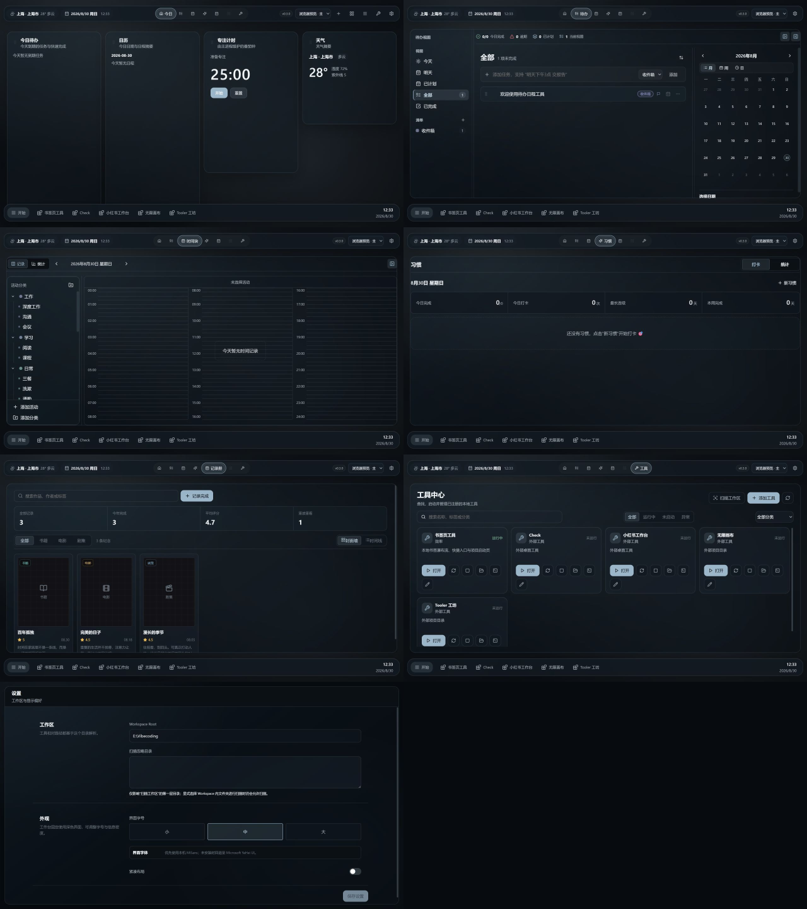

# 大锤的工作台 · GPT 项目上下文快照

这是“大锤的工作台”在 2026-08-31 的私有协作快照，供 GPT / Codex 理解产品背景、当前代码、视觉方向和真实实现边界。

> 本仓库是从正式本地工作目录筛选生成的干净快照，不包含真实数据库、日志、密钥、用户书签、用户图片、构建产物或本地 Git 历史。它不替代本机正式运行目录。

## 产品定位

“大锤的工作台”是一个 Windows 本地 Electron 工作台：在统一桌面壳层中直接呈现今日、待办、今日专注、习惯、纪念册、画布和工具中心，并继续通过统一入口启动独立工具。

它不是 Explorer 桌面替代品，也不移动、删除或重命名用户的真实桌面文件。首页只镜像安全入口；业务数据保留在 Electron `userData`，不会进入本仓库。

## 当前界面



主要页面与交互状态见 [截图索引](docs/SCREENSHOT_INDEX.md)。其中图片被明确区分为：真实实现、代码预览、批准方向和历史参考，避免把概念图误当成已经落地的功能。

## 技术栈

- Electron 37 + Electron Forge
- React 19 + TypeScript 5.9
- Vite 7 + Vitest 3
- Zustand、Radix UI、Lucide React、Recharts
- Windows 本地主进程、Preload、IPC 和 Renderer 分层

## 开发入口

```powershell
npm install
npm run dev:web
npm run typecheck
npm run test
```

正式 Windows 入口为 `启动.bat`；打包命令为 `npm run package`。本快照不包含 `release/`，也不应直接连接真实用户数据进行测试。

## GPT / Codex 阅读顺序

1. [GPT 项目背景](docs/PROJECT_CONTEXT_FOR_GPT.md)
2. [当前状态](docs/CURRENT_STATE.md)
3. [截图索引](docs/SCREENSHOT_INDEX.md)
4. [项目协作边界](AGENTS.md)
5. 需要实现时再读取相关 `src/` 与 `tests/`

## 当前状态说明

- 当前产品版本：`0.5.1`
- 待办 V2、习惯 V2、纪念册 V2 已接入真实业务接口。
- 原时间块方向已调整为番茄钟驱动的“今日专注”与一日投入总结。
- 首页、工具中心和部分跨页面视觉统一仍处在逐页确认阶段。
- 本快照记录的是当前代码现状，不代表所有视觉页面已经最终验收。

快照生成时验证结果：`npm run typecheck` 通过；`npm test -- --run` 通过，共21个测试文件、89项测试。

## 安全边界

- 不读取或上传 `.env`、密钥、数据库、日志和用户隐私数据。
- 不把演示 fixture 当成真实用户数据。
- 不移动或修改其他项目源码。
- 不把概念图中的虚构按钮、统计或 AI 建议直接实现为正式功能。
- Taskboard 工作流当前暂停。
