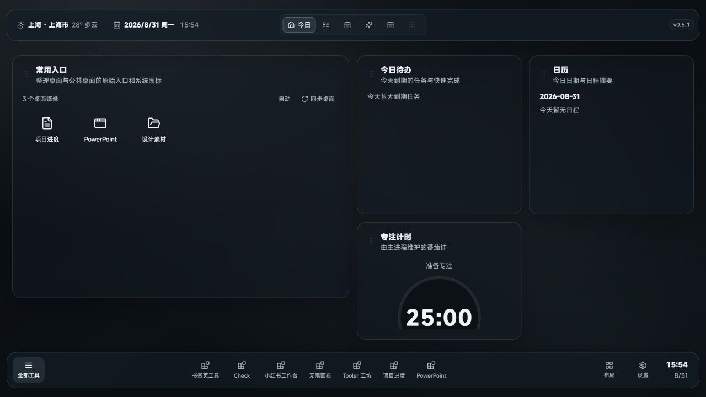

# 大锤的工作台 · GPT 项目上下文快照

这是“大锤的工作台”在 2026-08-31 的私有协作快照，供 GPT / Codex 理解当前代码、产品边界和界面现状。

> 本仓库是从正式目录筛选生成的独立快照，不包含真实数据库、日志、密钥、用户书签、用户图片、构建产物或本地 Git 历史。它不是正式运行目录。

## 当前事实入口

请严格按以下顺序阅读：

1. [当前状态](docs/CURRENT_STATE.md)
2. [当前界面证据](docs/CURRENT_UI/README.md)
3. [GPT 项目背景](docs/PROJECT_CONTEXT_FOR_GPT.md)
4. [截图与历史参考索引](docs/SCREENSHOT_INDEX.md)
5. [协作与数据边界](AGENTS.md)

旧原型、批准方向、问题对照图和名为 `final-*` 的 2026-08-30 图片均为历史参考，不代表当前页面。

## 当前界面



当前截图由 2026-08-31 最新源码通过隔离 Web 预览生成，使用预览数据，不读取真实用户数据库。首页、待办、今日专注、习惯、纪念册、工具中心、设置及关键交互态见[当前界面证据](docs/CURRENT_UI/README.md)。

## 产品定位

这是一个 Windows 本地 Electron 工作台，在统一壳层中直接呈现今日、待办、今日专注、习惯、纪念册、画布和工具中心，并通过统一入口启动独立工具。

它不是 Explorer 桌面替代品，不移动、删除或重命名用户的真实桌面文件。业务数据保留在 Electron `userData`，不会进入本仓库。

## 当前状态摘要

- 版本：`0.5.1`
- 待办 V2、今日专注、习惯 V2、纪念册 V2 已接入现有业务接口。
- 今日专注由番茄钟驱动，沿用原时间块标签，并生成一日投入汇总。
- 首页、工具中心和跨页面视觉仍按页面逐项验收，不能把当前快照理解为最终完成版。
- 页面截图是当前 Renderer 结构证据，不等同于正式 EXE、DPI、托盘和系统行为全部通过。

快照验证：`npm run typecheck` 通过；`npm test -- --run` 通过，共 21 个测试文件、89 项测试。

## 开发入口

```powershell
npm install
npm run dev:web
npm run typecheck
npm run test
```

正式 Windows 入口为 `启动.bat`；打包命令为 `npm run package`。本仓库不包含 `release/`，也不应连接真实用户数据进行测试。

## 安全边界

- 不读取或上传 `.env`、密钥、数据库、日志和用户隐私数据。
- 不把预览 fixture 当成真实用户数据。
- 不移动或修改其他项目源码。
- 不把概念图里的虚构按钮、统计或 AI 建议直接实现为正式功能。
- Taskboard 工作流当前暂停。
